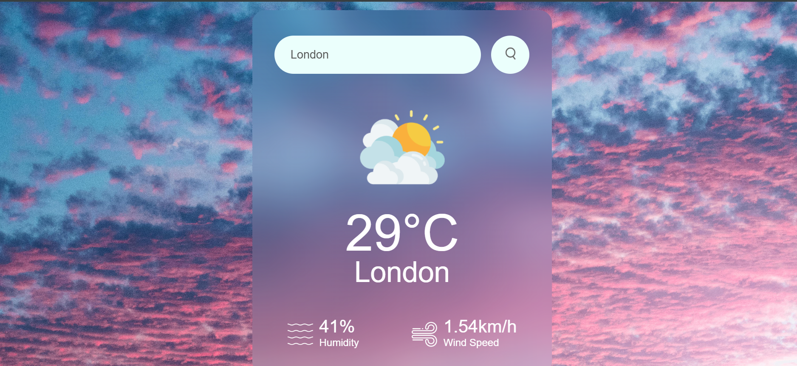

# 🌦️ Weather Web App(Internship Project)

Hey this is a simple and responsive weather application that I made during my **CodeClause Internship** using **HTML**, **CSS**, and **JavaScript** — no frameworks, just vibes 💫. It fetches real-time weather data from the **OpenWeatherMap API** and displays temperature, humidity, wind speed, and weather conditions for any city.

💡 Type a city name and boom — you'll get the current weather, temp, humidity, and wind speed — all fetched live from the OpenWeatherMap API!

---

## 🔍 Features

- 🌍 Search weather by city name
- 🌤️ Shows temperature, humidity, wind speed
- ☁️ Dynamic weather icons (Rain, Clear, Clouds, etc.)
- ❌ Error message for invalid city names

---

## 🧪 Tech Stack

- **Frontend:** HTML5, CSS3, JavaScript (Vanilla, no frameworks)
- **API:** [OpenWeatherMap](https://openweathermap.org/)
- **Design:** Aesthetic effect, custom icons, and background image

---

## 🚀 How to Run

1. **Clone the repository**
   ```bash
   git clone https://github.com/Noor3800/CodeClauseInternship_WeatherApp.git
   cd CodeClauseInternship_WeatherApp
   
2.Open index.html in your browser. That's it!

---

## 🧠 What I Learned

- How to fetch live data from APIs and display it on the web
- Making UIs responsive and visually engaging
- Building a project from scratch using only basic tools

---

## ✨ If I Had More Time...

- Add location-based weather using GPS 📍
- Add a dark mode 🌙
- Forecast for upcoming days 📆
- Maybe animate the icons for fun 🔄


---

## 📸 Sneak Peek





---
